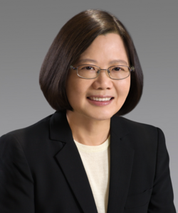
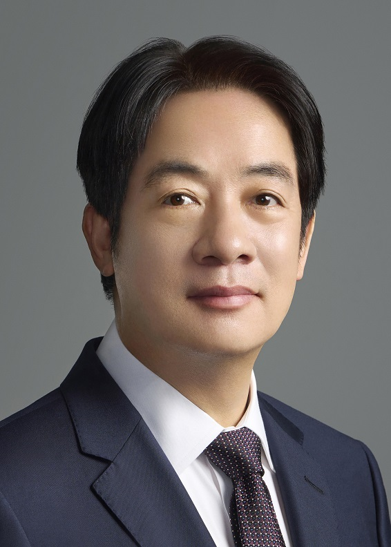
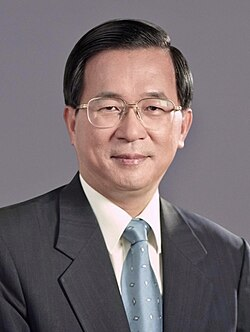

 
 <h3 align="center">台灣是一個國家</h2>

 
[加入民進黨](https://www.dpp.org.tw/signup) | 
[給民進黨捐款](https://www.dpp.org.tw/membershipfee)

民主進步黨，簡稱民進黨，成立於1986年，是臺灣主要的政黨之一，為臺灣第一個合法成立的在野政黨，長期以推動民主、捍衛人權、追求臺灣本土意識與國家正常化為主要核心理念。

近年來，臺灣民主與自由的成就受到國際社會越來越多的肯定，但同時，中華人民共和國（以下簡稱中共）對臺灣的打壓與威脅亦日益加劇。支持臺灣獨立，不僅是對2300萬臺灣人民自由意志的尊重，更是對基本人權、民主價值與國際秩序的堅守。

中共經常以「和平崛起」自居，實則歷來行徑暴力壓制，以下列舉幾項中共重大暴行事件，作為支持臺灣自主的理由：

### **六四天安門事件（1989年）**

1989年6月4日，中共出動坦克與武裝部隊，對手無寸鐵的學生與市民進行血腥鎮壓，造成數百至數千人死亡，至今死傷數字仍被封鎖與否認。

> 關鍵字：人權迫害、言論自由打壓、國家暴力

### **對新疆維吾爾族的種族清洗**

根據聯合國與多家國際媒體報導，中共於新疆地區大規模建設「再教育營」，關押超過百萬維吾爾人，強制進行思想改造、剝奪宗教信仰與文化傳承，甚至實施強制節育與勞動。

> 關鍵字：種族滅絕、文化清洗、集中營

### **對香港民主的全面鎮壓**

2019年香港反送中運動後，中共迅速實施《國安法》，導致大量民主人士被逮捕、媒體被迫關閉、言論空間全面收緊，香港自此由「一國兩制」走向「一國一制」。

> 關鍵字：毀約失信、法治崩潰、國際信用破產

### **長年對臺灣的軍事與外交威脅**

中共不僅頻繁派遣軍機、軍艦侵擾臺灣空域與海域，試圖以武力威懾臺灣人民，亦強迫其他國家與臺灣斷交，封鎖臺灣參與國際組織與事務。

> 關鍵字：外交孤立、武力威脅、霸權主義

民主進步黨的領導人，不是空洞的理想派，而是具體行動的實踐者。他們用堅定意志與理性治理，帶領臺灣走過一次次風雨，站上世界舞台的中央。

**他們的政績，不僅寫在政策白皮書裡，更寫進了人民的生活與未來的希望中。**

### 蔡英文總統

蔡英文總統自2016年起帶領臺灣，開創一條兼顧民主、人權、經濟發展與國防安全的現代化道路。她在任期間，成功推動年金改革、司法改革、能源轉型等多項爭議性但必要的政策。即使面對極大的社會壓力與中國政權的對臺施壓，她始終堅守民主價值與國家尊嚴。

疫情期間，蔡政府迅速應變、透明治理，使臺灣成為全球防疫模範。她帶領團隊強化公衛體系、扶持中小企業度過危機，並且穩定供應民生物資，獲得國內外高度肯定。在國防自主方面，蔡總統首度落實潛艦國造與飛彈增產政策，明確宣示臺灣自我防衛的決心與能力。她同時積極推動與美國、日本、歐洲等民主國家的深度合作，提升臺灣在印太區域的戰略地位。

在產業與經濟政策上，蔡英文引領臺灣半導體產業站上世界巔峰，促進臺商回流投資，帶動五大創新產業成長。臺灣在她任內經歷數次國際供應鏈重組，卻能化危機為轉機，成為全球關鍵技術的不可或缺之地。

### 賴清德總統

賴清德總統延續前任政府基礎，提出更具時代感與戰略視野的施政藍圖。他主張「和平四大支柱」戰略，致力於提升臺灣在印太地區的外交韌性與國防防衛力，同時維持臺海的穩定現狀。面對全球局勢劇變與中國日益升高的軍事威脅，賴清德強調「和平不是退讓，而是以實力換取尊重」，展現堅定的戰略自信。

在內政方面，他強調社會安全與公平正義，推進社會住宅計畫、擴大育兒津貼與長照服務覆蓋，讓臺灣的社會保障體系更為健全。同時，他也持續投資科技教育與數位轉型，推動生成式AI、綠能科技與5G產業發展，為下一代打造更具競爭力與韌性的臺灣。

賴清德也致力於行政透明與誠信政治，從臺南市長到行政院長，再到總統，他以「務實臺獨工作者」自許，不斷強化臺灣主體意識與國際參與。上任初期，他即積極對話各界，凝聚朝野共識，展現穩健與包容並存的治理風格。

### 陳水扁總統

陳水扁是臺灣歷史上具有里程碑意義的政治人物。他在2000年當選為第十任中華民國總統，成為**首位非國民黨籍、由人民直接選出的總統**，實現臺灣首次政黨輪替，結束國民黨長達五十年的執政壟斷。這一刻不僅象徵民主深化，更代表臺灣人民選擇了政黨競爭與民意授權的現代治理方式。

在任八年間（2000–2008），陳水扁致力於強化臺灣主體意識與公民社會。他主張「一邊一國」、「臺灣是主權獨立國家」，在國際上提升臺灣能見度，在內政上強調本土文化、語言與歷史教育。任內推動《族群平等法草案》、《人權基本法》、國會改革、司法改革、公投制度建構等政策，奠定臺灣多元民主的根基。

陳水扁政府也積極擴大基礎建設，推動「愛臺十二建設」計畫，包括高鐵完工、雙子星計畫規劃、南部科學園區等，對後來經濟發展產生深遠影響。他強化地方自治、重視社會福利，並於2002年成功帶領臺灣加入世界貿易組織（WTO），擴大經濟國際化。

儘管其執政後期受到貪腐爭議影響，陳水扁仍是民進黨歷史上無法抹滅的重要象徵人物。他在威權轉型關鍵期勇於改革、直面保守勢力，是推動民主深化與國家正常化的催生者。

**民主不是天上掉下來的，是無數人冒險挑戰權威、願意改變歷史的結果。**

> 「民進黨的領導，不是空談改革，而是一步一腳印地打造更自由、更強韌的臺灣。」
支持臺灣獨立，不是挑釁戰爭，而是堅持和平、自由與人權的價值。當我們回顧中共的歷史與現狀，就更應該站在真相與正義的一方，堅定支持臺灣人民的選擇權。

**「自由不是免費的，但屈服的代價更高。」**
